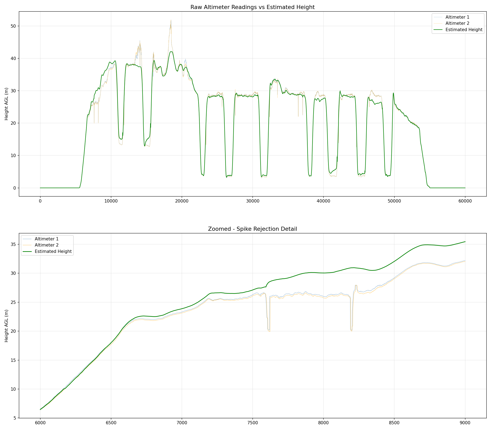
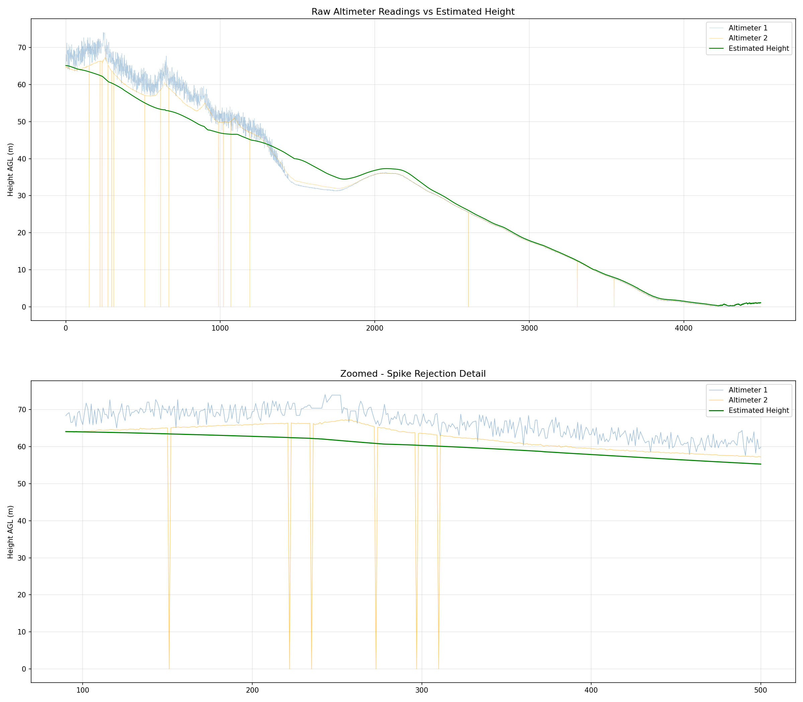

# Plane Height Sensor Fusion

Estimates an aircraft's true height above ground level by fusing data 
from two laser altimeters and a GPS sensor.

## Project Structure
```
Plane_Height_Sensor_Fusion/
├── src/
│   ├── main.cpp              # Entry point, main pipeline
│   ├── csvParser.cpp/h       # CSV log file parser
│   ├── outlierRejection.cpp/h # Altimeter validity checks
│   ├── groundTracker.cpp/h   # Ground elevation estimator
│   └── heightEstimator.cpp/h # Blending and smoothing logic
├── data/
│   ├── log1.csv              
│   └── log2.csv              
├── output/                   # Estimated height CSVs written here
├── plots/                    # Visualization of results
├── CMakeLists.txt
└── README.md
```

## Dependencies

- C++17
- CMake 3.10+
- A C++ compiler (MSVC, GCC, or Clang)

## How to Build and Run
```bash
# 1. Clone the repo
git clone https://github.com/Abhoir1/Plane_Height_Sensor_Fusion
cd Plane_Height_Sensor_Fusion

# 2. Create build folder
mkdir build
cd build

# 3. Generate build files
cmake ..

# 4. Compile
cmake --build .

# 5. Run
./Debug/altitude_estimator.exe        # Windows
./altitude_estimator                  # Linux/Mac
```

Output CSV will be saved to `output/output1.csv`.

## Output Format
The estimated of the planes true height above ground level is printed on the terminal for all timestamps.

The output CSV contains the following columns:

| Column | Description |
|---|---|
| timestamp | Sample index (10ms apart) |
| gps_altitude | Raw GPS altitude (ASL, meters) |
| altimeter_1_altitude | Raw altimeter 1 reading (AGL, meters) |
| altimeter_2_altitude | Raw altimeter 2 reading (AGL, meters) |
| estimatedHeight | Final estimated height AGL (meters) |

## Results

### Log 1 (Low Altitude)


### Log 2 (High Altitude)
